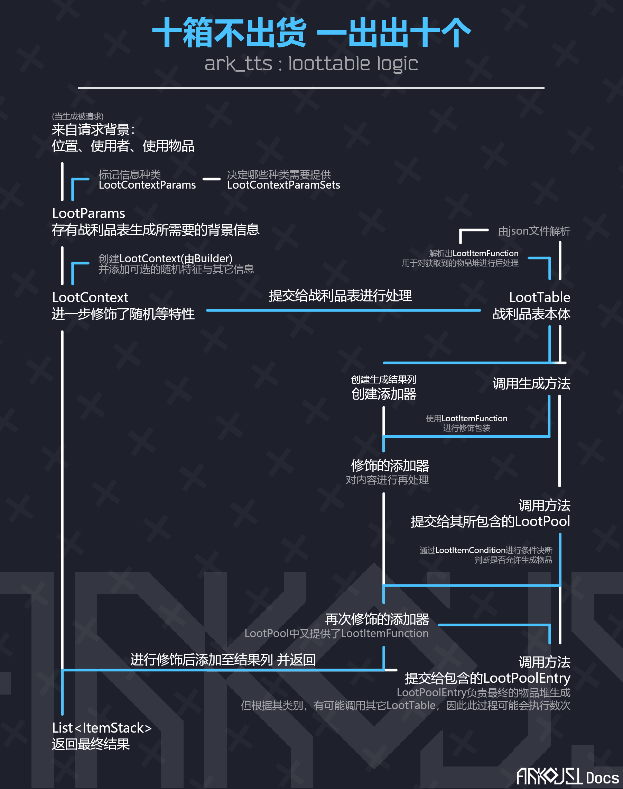

---
writers:
  - AW-CRK14
versions:
  id: "container"
  vanilla: "1.20.x"
  loaders:
    - text: "Neoforge 20.4.147-beta"
      loader: "neoforge"  
---

# 战利品表

战利品表(`LootTable`)是在游戏中常见的，用于从一组物品堆(`ItemStack`)中随机或根据条件挑选某个物品堆的设计。
在游戏原版中，方块在不同情况下的掉落(例如矿石的正常挖掘与精准采集的区别)，游戏中宝箱内容的生成，钓鱼或猫的礼物的决定都是由战利品表提供的。

本章节中不会过多的阐述战利品表的使用方法——这一篇的主要内容是如何为战利品表的json解析添加自定义的解析器。

## 战利品表的基本使用

战利品表以json文件形式，存储在`data/[modid]/loot_tables`下。对于不同的用途，通常也会在路径下再进行细分，
例如方块的掉落物就通常在路径下的`blocks`文件夹中，而箱子之类的物品随机生成在`chests`文件夹下。

在箱子一类的，实现了`RandomizableContainer`接口的类，可以使用`setLootTable`来设置其掉落物表；而对于具体的内容生成，需要参考对应的实现代码。
在该类中提供了默认方法用于便捷的处理生成：

```java
    default void unpackLootTable(@Nullable Player pPlayer) {
    Level level = this.getLevel();
    BlockPos blockpos = this.getBlockPos();
    ResourceLocation resourcelocation = this.getLootTable();
    if (resourcelocation != null && level != null && level.getServer() != null) {
        LootTable loottable = level.getServer().getLootData().getLootTable(resourcelocation);
        if (pPlayer instanceof ServerPlayer) {
            CriteriaTriggers.GENERATE_LOOT.trigger((ServerPlayer) pPlayer, resourcelocation);
        }

        this.setLootTable(null);
        LootParams.Builder lootparams$builder = new LootParams.Builder((ServerLevel) level)
                .withParameter(LootContextParams.ORIGIN, Vec3.atCenterOf(blockpos));
        if (pPlayer != null) {
            lootparams$builder.withLuck(pPlayer.getLuck()).withParameter(LootContextParams.THIS_ENTITY, pPlayer);
        }

        loottable.fill(this, lootparams$builder.create(LootContextParamSets.CHEST), this.getLootTableSeed());
    }
}
```

而钓鱼竿，你可以在`net.minecraft.world.entity.projectile.FishingHook#retrieve`下看到其源码。这里节选部分内容：

```java
static {
    LootParams lootparams = new LootParams.Builder((ServerLevel) this.level())
            .withParameter(LootContextParams.ORIGIN, this.position())
            .withParameter(LootContextParams.TOOL, pStack)
            .withParameter(LootContextParams.THIS_ENTITY, this)
            .withParameter(LootContextParams.KILLER_ENTITY, this.getOwner())
            .withLuck((float) this.luck + player.getLuck())
            .create(LootContextParamSets.FISHING);
    LootTable loottable = this.level().getServer().getLootData().getLootTable(BuiltInLootTables.FISHING);
    List<ItemStack> list = loottable.getRandomItems(lootparams);
    //...

    for (ItemStack itemstack : list) {
        ItemEntity itementity = new ItemEntity(this.level(), this.getX(), this.getY(), this.getZ(), itemstack);
        double d0 = player.getX() - this.getX();
        double d1 = player.getY() - this.getY();
        double d2 = player.getZ() - this.getZ();
        double d3 = 0.1;
        itementity.setDeltaMovement(d0 * 0.1, d1 * 0.1 + Math.sqrt(Math.sqrt(d0 * d0 + d1 * d1 + d2 * d2)) * 0.08, d2 * 0.1);
        this.level().addFreshEntity(itementity);
        player.level()
                .addFreshEntity(new ExperienceOrb(player.level(), player.getX(), player.getY() + 0.5, player.getZ() + 0.5, this.random.nextInt(6) + 1));
        if (itemstack.is(ItemTags.FISHES)) {
            player.awardStat(Stats.FISH_CAUGHT, 1);
        }
    }
}
```

## LootTable的有关类

让我们从最浅层说起：在上面的代码中，我们不难看到，有`LootParams`和`LootTable`两个类被使用。

### 交互层：`LootParams`与`LootTable`

我们先来看`LootParams`：

```java
LootParams lootparams = new LootParams.Builder((ServerLevel) this.level())
        .withParameter(LootContextParams.ORIGIN, this.position())
        .withParameter(LootContextParams.TOOL, pStack)
        .withParameter(LootContextParams.THIS_ENTITY, this)
        .withParameter(LootContextParams.KILLER_ENTITY, this.getOwner())
        .withLuck((float) this.luck + player.getLuck())
        .create(LootContextParamSets.FISHING);
```

不难看出，`LootParams`类的用途就是**为战利品生成提供触发条件信息**。

在这里，`LootContextParams`类下指定了该信息的种类，`withParameter`方法将一个种类与数据绑定，
这里配置了位置(*`ORIGIN`*)，使用的物品堆(*`TOOL`*)，主语实体(*`THIS_ENTITY`*)与宾语实体(*`KILLER_ENTITY`*)，还额外配置了幸运属性。
最后调用了`create`方法完成了构造。

这里传入的`LootContextParamSets`中指定了请求的内容种类，我们可以来略微看一下：

```java
public static final LootContextParamSet FISHING = register(
        "fishing", builder -> builder.required(LootContextParams.ORIGIN)
                .required(LootContextParams.TOOL) //要求 工具
                .optional(LootContextParams.THIS_ENTITY) //可选 主语实体 没看错的话似乎是那个浮标
                .required(LootContextParams.KILLER_ENTITY) //Forge: Add the fisher as a killer.
);
```

然后是`LootTable`，这其实是把我们的战利品表的json文件解析为了实例。从注册表中获取到实例，然后使用`getRandomItems`方法获取一组生成物。
对于钓鱼内容的战利品表，这通常只会生成一个物品堆。

在这个方法中，`LootParams`又被进一步修饰，添加随机特征(在战利品表中配置，可选)，转化为`LootContext`即战利品背景，
其builder内还有一些可选的配置内容，但在这里都没有被使用到。

### 结构层：`LootItemCondition`,`LootPoolEntryContainer`与`LootItemFunction`

让我们继续来深入探究`LootTable`内的内容，看看物品是怎么从中通过各种条件生成的。

先来聊聊其生成逻辑：在收到生成请求后，程序会创建一个物品堆添加器(呃，`Consumer<ItemStack>`)
用于向结果表中添加需要产出的物品。<font color="gray">(其实在生成阶段返回`List<ItemStack>`
也可以达到同样的效果，这么设计可能是方便对物品进行再修饰？见下)</font>
，然后对添加器进行二次包装，使用保有的`LootItemFunction`
进行修饰，最后发布给所有战利品池，也就是`LootPool`。

在`LootPool`中，逻辑将会通过条件决断(由`LootItemCondition`负责)，决断通过后将会发布给其所包含的`LootPoolEntryContainer`
请求物品。
由于`LootPoolEntryContainer`仍有可能指向其它战利品表，这一过程可能会循环执行几次。

这一张图片可以帮助我们理解：

其中，`LootItemCondition`,`LootPoolEntryContainer`与`LootItemFunction`这三种内容均可以自定义：

- `LootPoolEntryContainer`用于生成战利品结果，需要`LootPoolEntryType`(见`BuiltInRegistries.LOOT_POOL_ENTRY_TYPE`)
  来标记类型，同时实现`void createItemStack(Consumer<ItemStack> pStackConsumer, LootContext pLootContext)`方法，
  用于添加未修饰的结果物品堆。
- `LootItemCondition`用于决断战利品条件，需要`LootItemConditionType`(见`BuiltInRegistries.LOOT_CONDITION_TYPE`)
  来标记类型，同时实现`boolean test(LootContext pContext)`方法，用于判断此背景下生成条件是否成立。
- `LootItemFunction`用于修饰结果物品堆。需要`LootItemFunctionType`(见`BuiltInRegistries.LOOT_FUNCTION_TYPE`)
  来标记类型，同时实现`ItemStack run(ItemStack pStack, LootContext pContext)`方法，用于对已确定的物品堆进行修饰处理。

## 注册实例

上述三种可自定义的类的注册，均需要使用其对应的`Codec`完成。这里我们给出一个`LootPoolEntry`的范例：
```java
//假定我们现在有两种使用forge注册系统的自定义类:Material与MaterialItemType:
public class LootMaterialItem extends LootPoolSingletonContainer {
    //创建我们的codec。codec可以负责json信息与实例的相互转化
    public static final Codec<LootMaterialItem> CODEC = RecordCodecBuilder.create(ins -> ins.group(
                  Registry$Material.MATERIAL.holderByNameCodec().fieldOf("material").forGetter(i -> i.materialHolder),//存储Material信息。注意这里的Material是我们自定义的注册类，原版没有
                  Registry$Material.MATERIAL_ITEM_TYPE.holderByNameCodec().fieldOf("material_type").forGetter(i -> i.typeHolder))//存储MaterialItemType/信息。同上
          .and(singletonFields(ins))//将内容合并。调用的方法由父类提供，负责解析权重与其它修饰内容
          .apply(ins, LootMaterialItem::new)
    ) ;

    private final Holder<Material> materialHolder;
    private final Holder<MaterialItemType> typeHolder;

    protected LootMaterialItem(Holder<Material> materialHolder, Holder<MaterialItemType> typeHolder, int pWeight, int pQuality, List<LootItemCondition> pConditions, List<LootItemFunction> pFunctions) {
        super(pWeight, pQuality, pConditions, pFunctions);
        this.materialHolder = materialHolder;
        this.typeHolder = typeHolder;
    }

    //实现createItemStack方法，允许我们在前置条件允许的情况下，返回一个或多个物品堆
    @Override
    protected void createItemStack(Consumer<ItemStack> pStackConsumer, LootContext pLootContext) {
        pStackConsumer.accept(System$Material.getFromMAndMIT(materialHolder.value(), typeHolder.value()));//通过特定方法，将我们的Material与MaterialItemType转化为物品堆
//        pStackConsumer.accept([其他的物品堆]);//如果需要返回多个物品堆，多次调用consumer即可
    }

    //返回我们注册的类型
    @Override
    public @NotNull LootPoolEntryType getType() {
        return CodecReg.MATERIAL_ITEM_LOOT_POOL.get();
    }
}

//注册部分
public class CodecReg {
    //创建LootPoolEntryType的注册器。别忘了在mod主类中将其注册至IModEventBus！
    public static final DeferredRegister<LootPoolEntryType> LOOT_POOL = DeferredRegister.create(Registries.LOOT_POOL_ENTRY_TYPE, BreakdownCore.MODID);

    //注册我们刚刚创建的LootPoolSingletonContainer子类。这一内容可以在getType方法里使用。
    public static final DeferredHolder<LootPoolEntryType, LootPoolEntryType> MATERIAL_ITEM_LOOT_POOL = LOOT_POOL.register("material_item", () -> new LootPoolEntryType(LootMaterialItem.CODEC));
}
```

这样，只需在你的loottable对应位置将type设定为你注册的id，你就可以使用自定义的LootPoolEntry了。